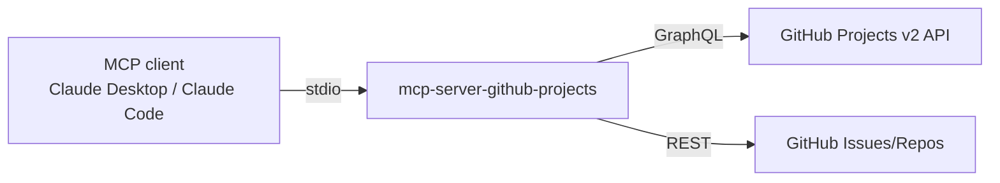

# mcp-server-github-projects

[](LICENSE)
[](https://www.typescriptlang.org/)
[](https://modelcontextprotocol.io/)

A [Model Context Protocol](https://modelcontextprotocol.io/) server for the **GitHub Projects v2 API** — it fills the gap the official GitHub MCP server leaves around project management: views, priorities, dependencies, and metrics, exposed as typed tools an LLM agent can call.

Why it exists: Projects v2 is GraphQL-only and fiddly to drive by hand. Wrapping it in MCP tools lets an agent triage a backlog ("assess priorities for everything in the Sprint view, then re-order it") in one conversation.

## How it works



Operations live in `src/operations/` (projects, project-items, project-views, priorities, dependencies, metrics), each with typed inputs validated before any API call.

## Setup

> **Note:** this package is not on npm — build from source (2 minutes):

```bash
git clone https://github.com/TerraCo89/mcp-server-github-projects.git
cd mcp-server-github-projects
npm install && npm run build
```

Create a GitHub personal access token with `project` (read/write) and `repo` (read) scopes.

### Use with Claude Desktop / Claude Code

```json
{
  "mcpServers": {
    "github-projects": {
      "command": "node",
      "args": ["/path/to/mcp-server-github-projects/dist/index.js"],
      "env": { "GITHUB_TOKEN": "YOUR_TOKEN_HERE" }
    }
  }
}
```

Docker alternative: `docker build -t mcp/github-projects .` then use `docker run -i --rm -e GITHUB_TOKEN mcp/github-projects` as the command.

## Available operations

### Projects & items
- `createProject` / `listUserProjects` / `listOrganizationProjects` — project CRUD and discovery
- `addProjectItem` / `deleteProjectItem` / `listProjectItems` — manage items
- `getProjectFields` / `updateProjectField` — read and write custom fields

### Views
- `createProjectView` / `updateProjectView` / `deleteProjectView` / `listProjectViews`

### Priorities
- `assessItemPriority` — score one item's priority from its content and context
- `batchUpdatePriorities` — re-prioritize many items in one call

### Dependencies & metrics
- `manageItemDependencies` / `analyzeDependencies` — model and analyze blocking relationships
- `generateProjectMetrics` — throughput/status summaries for a project

### Example interaction

> **User:** "What's blocking the v2 release?"
>
> **Agent** calls `listProjectItems` on the release project → `analyzeDependencies` → reports the two items whose dependency chains are unresolved, with links.

## Development

```bash
npm install
npm run build    # tsc → dist/
npm run watch    # rebuild on change
```

## License

[MIT](LICENSE)
